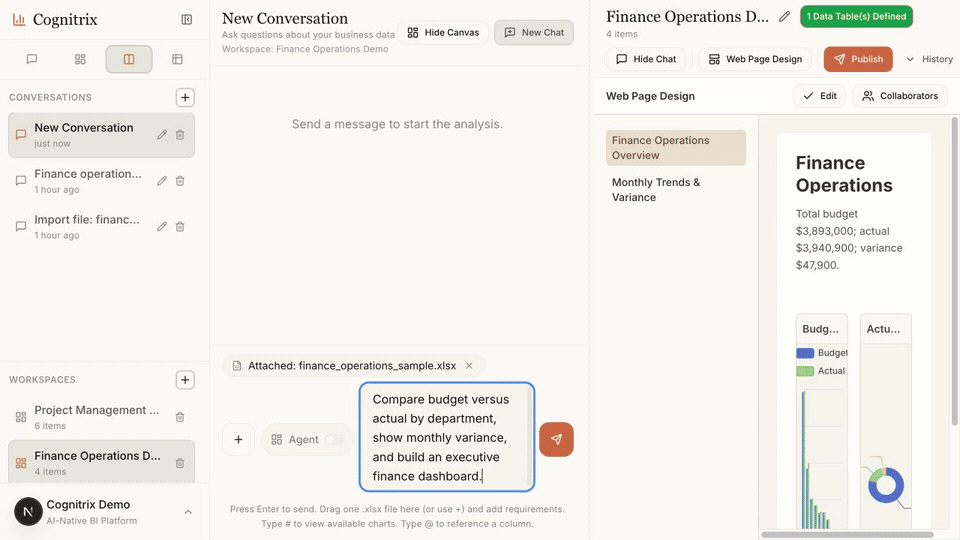
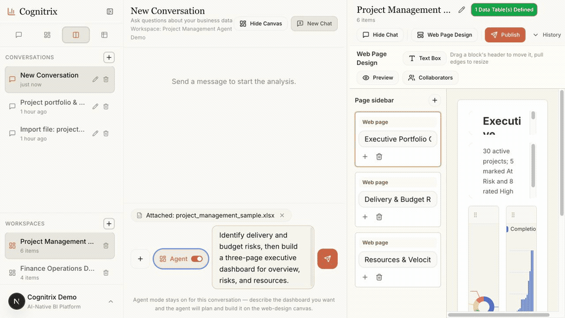

# Cognitrix — AI-Native BI & Analytics Platform

English | [简体中文](README_CN.md) | [日本語](README_JA.md)

[](https://www.python.org/)
[](https://nodejs.org/)
[](https://fastapi.tiangolo.com/)
[](https://nextjs.org/)
[](https://duckdb.org/)
[](LICENSE)

> **Upload Excel → Ask in natural language → Get charts & dashboards.**
> An open-source, AI-native business intelligence platform that turns any structured spreadsheet into an interactive analytics workspace — no SQL, no data warehouse, no pre-built dashboards required.

---

## What is Cognitrix?

**Cognitrix** is an AI-native BI platform for structured data analytics. It replaces the traditional BI stack — ETL pipelines, fixed dashboards, SQL expertise — with a conversational AI agent that understands business questions and generates charts on demand.

Key differentiators versus traditional BI tools (Tableau, Power BI, Metabase):

| Capability | Traditional BI | Cognitrix |
|---|---|---|
| Data onboarding | Warehouse + ETL pipeline | Upload Excel directly |
| Querying | Drag-and-drop / SQL | Natural language conversation |
| Chart creation | Manual configuration | AI-generated, spec-driven |
| Ad-hoc analysis | Requires analyst support | Self-service, instant |
| Access control | Dashboard-level | Row-level security (RLS) per role |
| Share & collaborate | Static links | Versioned views, RBAC-gated |

---

## Key Features

- **Natural Language Analytics** — Ask questions like "show attrition by department" or "find high-risk projects" and get charts, tables, and takeaways instantly.
- **Excel to Insights in Minutes** — Upload any structured spreadsheet; the Agentic Ingestion pipeline infers schema, resolves column names, and creates a queryable DuckDB dataset.
- **Agentic Query Engine** — A ReAct agent loop (Claude/DeepSeek-compatible) explores table structures, selects semantic metrics, and generates read-only SQL — all transparently streamed to the UI.
- **Semantic Metric Layer** — YAML-driven metric definitions prevent AI hallucinations on business KPIs (headcount, attrition rate, project velocity, budget burn, etc.).
- **AI-Generated Dashboards** — Specs streamed as JSON are rendered by ECharts (heatmap, sankey, gauge, graph) and Recharts (bar, line, pie, scatter, funnel, table, KPI card).
- **Visual Workspace & Agent Canvas** — Compose charts manually on a multi-format canvas, or let the optional long-horizon agent create an approved, multi-page dashboard outline and stream it into the workspace.
- **Multi-Chart Generation & Saved Prompts** — Generate a confirmed set of charts from one question and reuse parameterized prompts with capability presets.
- **Durable Collaboration** — Workspaces, conversations, messages, chart assets, and canvas snapshots are persisted server-side, with localStorage retained as a fast offline cache and migration source.
- **Members, Invites & Publishing** — Manage owner/editor/viewer roles, issue expiring invite links, and publish pages as public, registered-user-only, or allowlist-only experiences with a read-only public assistant.
- **Versioned Views & Sharing** — Save, version, roll back, and share analysis views with role-aware data redaction at the API layer.
- **Enterprise-Grade Security** — JWT auth, RBAC permission scopes, row-level security injection, SQL read-only validation, audit logging, and jailbreak guardrails.
- **Optional Web Research** — Feature-gated Bocha or Tavily search/fetch tools use explicit per-turn budgets and never bypass the BI tool guardrails.
- **Operations Console** — A superadmin UI controls runtime settings, model credentials, users, roles, usage telemetry, and Agent Skills; secrets remain write-only.
- **Anthropic-Compatible Agent Runtime** — DeepSeek's Anthropic gateway is the default; native Anthropic/Claude or another compatible endpoint can be selected through environment settings.
- **Self-Hosted & Open Source** — Runs locally or in Docker; no cloud lock-in, no SaaS fees.

---

## Use Cases

- **HR Analytics** — Workforce headcount, attrition trends, compensation benchmarking, performance distribution, department-level drill-downs.
- **Project Management BI** — Sprint velocity, budget burn rate, task completion rates, resource utilization, risk heatmaps.
- **Sales & Revenue** — Pipeline analysis, win/loss rates, quota attainment, territory comparisons from CRM exports.
- **Finance & Operations** — Cost center breakdowns, budget vs actuals, operational KPIs — all from existing Excel reports.
- **Executive Dashboards** — Compose multi-chart workspaces, save them as versioned views, and share with role-restricted audiences.

---

## Product Demos

### Finance operations: Excel to interactive analysis

Upload `sample_data/finance_operations_sample.xlsx`, ask about budget versus actuals and monthly variance, then turn the generated charts into a two-page finance workspace.



### Project management: Agent-generated web dashboard

Upload `sample_data/project_management_sample.xlsx`, investigate delivery and budget risks, and let Agent mode build a three-page executive dashboard for portfolio overview, risks, and resources.



> These animations are deterministic local replays calculated from the bundled workbooks. Configure model credentials to run the same ingestion and Agent steps live.

---

## Functional Architecture

[](docs/diagrams/functional-architecture-en.html)

---

## Tech Stack

| Layer | Technology |
|---|---|
| **Backend** | FastAPI, Pydantic Settings, Python 3.11+ |
| **Analytics Engine** | DuckDB (in-process OLAP), Pandas, sqlglot |
| **Agent Runtime** | Claude Agent SDK / Anthropic Messages protocol |
| **Frontend** | Next.js 15 App Router, React 18, TypeScript |
| **State Management** | Zustand, TanStack Query |
| **Visualization** | ECharts, Recharts, React Flow |
| **Auth & Security** | JWT, RBAC, Row-Level Security, SQL Validator |
| **Storage** | DuckDB (analytics), SQLite (state), filesystem (uploads) |
| **Delivery** | Docker Compose, Makefile |

---

## Quick Start

**Requirements:** Python 3.11+, Node.js 20+, npm 10+, GNU Make

```bash
# 1. Install all dependencies and generate .env files
make bootstrap

# 2. Validate environment variables
make env-check

# 3. Start API (port 8000) and Web (port 3000)
make dev
```

Open **http://127.0.0.1:3000** — upload one of the sample Excel files to start querying.

> See [Local Configuration](#local-configuration) for API keys and provider setup.

### Administration console

Fresh local installations created from `.env.example` include a development superadmin:

- Email: `admin@cognitrix.local`
- Password: `Admin@123456`
- Console: `http://127.0.0.1:3000/admin`

Override `AUTH_BOOTSTRAP_ADMIN_EMAIL`, `AUTH_BOOTSTRAP_ADMIN_PASSWORD`, and
`AUTH_BOOTSTRAP_SUPERADMIN_EMAIL` before first startup, or set them empty to
disable bootstrap. The documented password is rejected when `APP_ENV=production`.
The console manages Agent Skills, every declared backend environment setting,
model provider credentials, registered users, and per-user usage telemetry.
Secrets are write-only and infrastructure/security settings are labeled when an
API restart is required.

---

## Current Status

- The product workspace provides Chat, Canvas, Split, and Catalog modes with `Cmd/Ctrl + 1/2/3/4`; `Cmd/Ctrl + B` toggles the sidebar, and the split divider is resizable.
- `POST /chat/stream` emits `planning`, `tool_use`, `tool_result`, `spec`, `final`, and `error`; optional Agent Canvas runs also emit durable, ordered `canvas_op` events. Legacy `reasoning` and `tool` mirrors remain for compatibility.
- The canvas supports chart, text, sticky-note, divider, section, and grouped nodes; multiple page/print formats, backgrounds, web-design grids, multi-page dashboards, export, print, autosave, and run-level undo are implemented.
- Conversations, messages, chart assets, workspace metadata, and canvas snapshots now have durable server stores. The browser cache is loaded first for responsiveness and then merged with the server copy for cross-device recovery.
- Workspace collaboration includes owner/editor/viewer membership, expiring invites, hard-delete cleanup, and published pages with `public`, `registered`, or `allowlist` visibility.
- The admin control plane manages settings, model connectivity, users, roles, status, usage telemetry, and Agent Skills. The repository's development template disables Agent Canvas, web research, and runtime skill loading by default; each must be enabled explicitly.
- The repository has backend, security, integration, evaluation, performance, script, smoke, frontend unit, and Playwright coverage. It remains an actively evolving product rather than a finished enterprise release.

---

## Core Capabilities

### Turn Excel into analyzable data assets

- Business teams can upload arbitrary structured spreadsheets — HR, sales, finance, or operations data — without first building a warehouse, writing SQL, or conforming to complex templates.
- The system automatically recognizes common field meanings, combines multiple spreadsheets, and produces datasets that can continue into analysis.
- After upload, it returns data quality feedback so teams can judge whether the data is complete and suitable for further analysis.
- A built-in extensible semantic metric layer, driven by YAML, supports cross-domain metric definitions so business questions can be understood and calculated directly.

### Analyze ad-hoc questions through conversation

- Users can ask questions as if speaking with a business analyst — "show attrition by department", "find high-risk projects", "show the distribution by hire year".
- The agent explores table structures, reads samples, chooses semantic metrics, or generates read-only SQL based on the question, reducing manual schema trial-and-error and metric refinement.
- For standard metrics, the system prioritizes stable definitions. For ad-hoc questions, the AI analysis assistant can still perform flexible data exploration.
- Answers include results, generated charts, and short takeaways to help users decide what to inspect next.
- Multi-turn conversations retain `agent_session_id` and the latest structured result, supporting follow-ups like "change it to a line chart" or "break it down by department".

### Move from insight to visual workspace

- Charts generated in conversation can be saved as chart assets and then arranged in the workspace.
- Users can switch between conversation, canvas, split, and catalog modes, turning one-off Q&A into reusable analytical dashboards.
- The GenUI catalog covers common and advanced forms including grouped/negative bars, stacked lines, pie, area, scatter and clustering, radar, treemap, single/multiple funnels, tables, KPI cards, heatmap, gauge, sankey, sunburst, boxplot, candlestick, graph, map, parallel coordinates, and word cloud.
- Analysis context is preserved so later follow-ups, filters, and chart adjustments feel natural.

### Make views visible with permissions

- Key analyses can be saved as views and opened through a dedicated presentation entry. Authenticated users can read content they own or are allowed to access.
- The share entry also requires Bearer authentication and redacts saved AI state in the response according to the caller role.
- Published workspace pages can be public, restricted to registered users, or restricted to an explicit allowlist. Legacy saved-view sharing continues to enforce owner/admin and `views:share` permissions.
- A view can be updated and rolled back by version, which is useful for weekly reports, project reviews, and management dashboards that evolve over time.
- Uploads, queries, analysis actions, permission changes, and rollbacks are audited for traceability.

---

## Repository Layout

```text
.
├── apps/api              # FastAPI backend (agent runtime, semantic layer, security)
├── apps/web              # Next.js frontend (chat, workspace, share, catalog)
├── models                # HR / PM semantic metric definitions (YAML)
├── sample_data           # Example Excel files for local testing
├── tests                 # Backend, integration, security, eval, and smoke tests
├── scripts               # Dev/start/deploy entrypoints plus grouped helper scripts
│   ├── checks            # Env validation, lint, and build checks
│   ├── maintenance       # Local data reset and one-off migration helpers
│   ├── setup             # Bootstrap and local service setup helpers
│   └── tests             # Test and smoke-test runners
├── deploy                # Server and Hugging Face deployment guidance/assets
├── docs/adr              # Architecture decision records
├── infra/docker          # Alternative Docker Compose configurations
├── openspec              # Change proposals, specs, and implementation tasks
└── packages/shared       # Shared package placeholder
```

---

## Requirements

- Python 3.11+
- Node.js 20+
- npm 10+
- GNU Make
- Docker Desktop — optional; only required for container delivery and Docker smoke tests

---

## Common Commands

```bash
make help              # Show available commands
make bootstrap         # Install Python / Web dependencies and initialize .env files
make env-check         # Validate apps/api/.env and apps/web/.env
make dev               # Start API and Web together
make dev-api           # Start only FastAPI
make dev-web           # Start only Next.js
make dev-local         # Start in debug mode, writing logs to logs/dev-local
make lint              # Backend compileall + frontend lint
make test              # Backend pytest by default
make build             # Backend compile check + frontend production build
make smoke-local       # Local end-to-end smoke flow
make smoke-docker      # Docker end-to-end smoke flow
make test-all          # Intended full gate; currently see Known Boundaries
make reset-local-data  # Clear local runtime data
make docker-up         # Build and start Docker Compose
make docker-down       # Stop Docker Compose
make docker-publish    # Build and push API/Web images to Docker Hub
make docker-start      # Start/rebuild the server stack and print endpoints
make docker-restart    # Rebuild/restart without deleting persistent data
make deploy            # One-command production-style server deployment
make hf-deploy         # Deploy to a configured Hugging Face Space
```

---

## Local Configuration

`make bootstrap` generates the following files from templates when they are missing:

- `apps/api/.env`
- `apps/web/.env`

Key backend variables:

```env
DATABASE_URL=sqlite:///./data/uploads/state/ai_views.sqlite3
MODEL_PROVIDER_URL=https://api.deepseek.com
AI_API_KEY=
AI_MODEL=deepseek-chat
ANTHROPIC_BASE_URL=https://api.deepseek.com/anthropic
ANTHROPIC_AUTH_TOKEN=
ANTHROPIC_DEFAULT_HAIKU_MODEL=deepseek-chat
API_TIMEOUT_MS=600000
CLAUDE_AGENT_SDK_ENABLED=true
AGENTIC_INGESTION_ENABLED=false
AGENT_CANVAS_MODE_ENABLED=false
WEB_SEARCH_ENABLED=false
AGENT_SKILLS_ENABLED=false
AUTH_SECRET=replace-with-a-strong-secret
UPLOAD_DIR=./data/uploads
CORS_ALLOW_ORIGINS=http://127.0.0.1:3000,http://localhost:3000
```

Excel uploads always use Agentic ingestion. `AGENTIC_INGESTION_ENABLED` is kept only for compatibility with older environment files and no longer disables `/ingestion/*`.

Key frontend variables:

```env
API_BASE_URL=http://127.0.0.1:8000
NEXT_PUBLIC_API_BASE_URL=http://127.0.0.1:8000
NEXTAUTH_URL=http://127.0.0.1:3000
NEXTAUTH_SECRET=replace-with-a-strong-secret
```

The browser client calls the same-origin proxy path `/api/backend/*`. `API_BASE_URL` is the preferred runtime-only destination; `NEXT_PUBLIC_API_BASE_URL` remains in the local bootstrap template as a fallback. This keeps public web images portable: do not bake deployment IPs into `NEXT_PUBLIC_*` variables.

Optional context overrides:

```env
NEXT_PUBLIC_DEFAULT_USER_ID=demo-user
NEXT_PUBLIC_DEFAULT_PROJECT_ID=demo-project
NEXT_PUBLIC_DEFAULT_ROLE=hr
NEXT_PUBLIC_DEFAULT_DEPARTMENT=HR
NEXT_PUBLIC_DEFAULT_CLEARANCE=1
NEXT_PUBLIC_DEFAULT_DATASET_TABLE=employees_wide
```

Agentic Query runs through the Claude Agent SDK, but defaults to DeepSeek's Anthropic-compatible endpoint. `AI_API_KEY` is passed to the SDK CLI as `ANTHROPIC_API_KEY` and `ANTHROPIC_AUTH_TOKEN`; `ANTHROPIC_BASE_URL` defaults to `https://api.deepseek.com/anthropic`; `AI_MODEL` defaults to `deepseek-chat`. If you need to override the Claude Code CLI token separately, set `ANTHROPIC_AUTH_TOKEN`.

---

## Agentic Query

The conversation entry always uses the agent orchestration path. The older rule-based chat path is no longer a runtime branch.

Agent configuration:

```env
CLAUDE_AGENT_SDK_ENABLED=true
AGENTIC_INGESTION_ENABLED=false
AGENT_CANVAS_MODE_ENABLED=false
AGENT_MAX_TOOL_STEPS=20
AGENT_MAX_SQL_ROWS=2000
AGENT_MAX_SQL_SCAN_ROWS=10000
AGENT_TIMEOUT_SECONDS=120
```

The agent tool surface is limited to BI-related operations:

- `list_tables`
- `describe_table`
- `sample_rows`
- `get_metric_catalog`
- `run_semantic_query`
- `execute_readonly_sql`
- `get_distinct_values`
- `save_view`

When enabled, web research adds `web_search`, `web_fetch`, and `save_web_research`. Agent Canvas registers a separate, constrained canvas tool surface and emits ordered `canvas_op` events; it does not grant arbitrary filesystem or network access.

At runtime, `conversation_id` maps to a resumable `agent_session_id`, and session state is persisted to `UPLOAD_DIR/state/agent_sessions.sqlite3`. All tool calls continue to reuse the existing SQL read-only validation, RLS injection, sensitive-field filtering, response redaction, and audit logging.

Current major events from `POST /chat/stream`:

- `planning`
- `tool_use`
- `tool_result`
- `spec`
- `final`
- `error`
- `canvas_op` (Agent Canvas only)

Compatibility events: `reasoning`, `tool`

Design details are available in `docs/adr/0001-agentic-query-runtime.md`.

---

## API Overview

Most business APIs require `Authorization: Bearer <token>`. Registration and email login are public entry points; the credential-free legacy `/auth/login` route is development-only and is refused in production. The frontend caches the authenticated session and sends the Bearer token automatically.

| Method | Path | Description |
|---|---|---|
| `GET` | `/healthz` | Service health check |
| `POST` | `/auth/register` | Register an email/password account |
| `POST` | `/auth/email-login` | Authenticate an account |
| `GET` | `/auth/me` | Read the current identity |
| `POST` | `/auth/roles/{user_id}` | Manage user role overrides |
| `GET` | `/audit/events` | Query audit events |
| `POST` | `/ingestion/uploads` | Upload Excel and create an Agentic ingestion job |
| `POST` | `/ingestion/plan` | Generate a write plan through the Write Ingestion Agent |
| `POST` | `/ingestion/setup/confirm` | Confirm catalog setup when required |
| `POST` | `/ingestion/approve` | Approve an agent write plan |
| `POST` | `/ingestion/execute` | Execute an approved write plan |
| `GET` | `/semantic/metrics` | Fetch semantic metric catalog |
| `POST` | `/semantic/query` | Run semantic query |
| `POST` | `/chat/tool-call` | Call BI tools directly |
| `POST` | `/chat/stream` | Stream AI conversation and chart generation |
| `GET` | `/chat/capabilities` | Read enabled generation capabilities |
| `GET/POST` | `/saved-prompts` | List or create reusable prompts |
| `GET/POST` | `/workspaces` | List or create workspaces |
| `POST` | `/workspaces/{workspace_id}/invites` | Create a workspace invite |
| `POST` | `/workspaces/{workspace_id}/publish` | Publish a workspace page |
| `POST` | `/views` | Save AI view |
| `GET` | `/views/{view_id}` | Read private view |
| `GET` | `/share/{view_id}` | Read shared view |
| `POST` | `/views/{view_id}/rollback/{version}` | Roll back a view version |

---

## End-to-End Validation

Local smoke flow:

```bash
make smoke-local
```

Covered workflow:

```text
healthz → auth/login → upload Excel → semantic query → chat stream → save view → share view
```

Intended full quality gate (currently blocked by the missing frontend `test` package script; see [Known Boundaries](#known-boundaries)):

```bash
make test-all
```

Focused checks:

```bash
.venv/bin/python -m pytest tests -q
.venv/bin/python -m pytest tests/security -q
.venv/bin/python -m pytest tests/integration -q
npm run --prefix apps/web build
```

---

## Docker Delivery

One-command server deployment (no pre-existing `.env` or model key required):

```bash
PUBLIC_URL=http://172.16.5.38:3000 bash scripts/deploy.sh
```

The script generates secrets and a random superadmin password, enables Agent Canvas, builds and starts the stack, waits for health checks, and prints the URL and credentials. Configure model keys, web search, and agent limits later in `/admin`. Re-running it upgrades/restarts the compute services without deleting the persistent volume. See [deploy/README.md](deploy/README.md) for the operations guide.

Manual build and start:

```bash
docker compose up -d --build
docker compose ps
```

Runtime API routing:

- Browser requests go to the web origin, for example `http://localhost:3000/api/backend/jobs`.
- The web container forwards those requests to `API_BASE_URL`.
- In Docker Compose, set `API_BASE_URL=http://api:8000` for the web service. This is the default in the repository Compose files.

Example `.env` for a host reachable at `172.16.5.38`:

```env
TAG=1.0.1
API_BASE_URL=http://api:8000
APP_URL=http://172.16.5.38:3000
NEXTAUTH_URL=http://172.16.5.38:3000
CORS_ALLOW_ORIGINS=http://172.16.5.38:3000,http://localhost:3000
```

`CORS_ALLOW_ORIGINS` only needs the public web origin if you call the API directly from the browser. The built-in web UI normally avoids CORS by using the same-origin proxy.

Stop:

```bash
docker compose down --remove-orphans
```

Make wrappers:

```bash
make docker-up
make docker-down
make smoke-docker
```

Default Compose exposure:

- Web: `127.0.0.1:3000`
- API: `127.0.0.1:8000`

### Persistent Storage Container

The Compose stack runs a dedicated `storage` service (`cognitrix-storage`) that
owns the persistent runtime data and keeps its lifecycle separate from the
compute containers:

- It mounts the named volume `cognitrix_upload_data` (rendered by Docker as
  `cognitrix_cognitrix_upload_data`) at `/storage/uploads`.
- On startup it creates the required runtime directories (`state`, `audit`,
  `agent_skills`) **without deleting existing files**, writes a readiness
  marker, and stays alive as the storage owner.
- Its healthcheck verifies the volume and `state/` are writable; the `api`
  service has `depends_on: storage (condition: service_healthy)`, so the API
  starts only after storage is initialized.
- Only the API writes application data. The API still consumes the same volume
  at `/app/data/uploads` (`UPLOAD_DIR`), and the default SQLite `DATABASE_URL`
  resolves under that tree (`/app/data/uploads/state/ai_views.sqlite3`).

Retained under the storage volume: uploaded source files, per-user/project
DuckDB databases, SQLite state under `state/`, audit logs, agent session state,
saved views, and catalog metadata.

**Restarts preserve data.** `make docker-restart`, `make docker-up`,
`make docker-start`, `make docker-down`, and image rebuilds never pass
`--volumes` and never delete the storage volume. A restart is a compute
lifecycle event only.

To verify persistence end-to-end against a Docker host, run:

```bash
bash scripts/tests/docker_persistence.sh
```

It writes a sentinel and a `state/` marker into the volume, runs the normal
restart workflow, and asserts both survive and `state/` is still writable.

---

## Sample Data

Upload these files via the ingestion UI or `POST /ingestion/uploads` to create a working DuckDB session:

- `sample_data/hr_workforce_upload_sample.xlsx`
- `sample_data/hr_workforce_upload_sample_zh.xlsx`
- `sample_data/sales_pipeline_sample.xlsx`
- `sample_data/finance_operations_sample.xlsx`
- `sample_data/project_management_sample.xlsx`

After upload, use the returned `dataset_table` for subsequent semantic query and chat requests.

---

## Data Reset

Clear local runtime data, uploads, DuckDB / SQLite state, logs, and test artifacts:

```bash
make reset-local-data
```

Preview what will be deleted:

```bash
.venv/bin/python scripts/maintenance/reset_local_data.py --dry-run
```

Also reset the database referenced by `apps/api/.env`:

```bash
.venv/bin/python scripts/maintenance/reset_local_data.py --with-db-reset
```

Also remove Docker Compose named volumes:

```bash
.venv/bin/python scripts/maintenance/reset_local_data.py --include-docker-volumes
```

> **Destructive reset is explicit and separate from restart.** This
> `--include-docker-volumes` path is the **only** workflow that deletes the
> persistent `cognitrix_upload_data` Docker volume (it runs
> `docker compose down --remove-orphans --volumes`). It prompts for
> confirmation unless `--yes` is supplied. The restart/start/stop scripts
> (`make docker-restart`, `make docker-up`, `make docker-start`,
> `make docker-down`) never delete this volume — use this reset command only
> when you intentionally want to erase persisted Docker data.

---

## Contributing

Contributions are welcome! Please read [CONTRIBUTING.md](CONTRIBUTING.md) for guidelines on how to submit issues, propose features, and open pull requests.

---

## Known Boundaries

- Agent Canvas, web research, and Agent Skills are feature-gated. The development template disables all three by default; `scripts/deploy.sh` enables Agent Canvas in its generated server environment. Optional provider-backed features still require credentials and suitable operational limits.
- localStorage is still the synchronous live cache. Server synchronization is best-effort, so temporary network failures can leave a device-local copy until the next successful commit or hydration pass.
- Model quality, cost controls, long-session UX, and domain evaluation coverage still require production-specific tuning.
- Frontend Vitest and Playwright suites exist, but `apps/web/package.json` does not yet expose unified `npm test`, `test:ui`, or `test:e2e` scripts.
